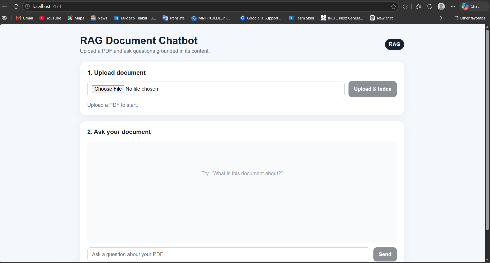
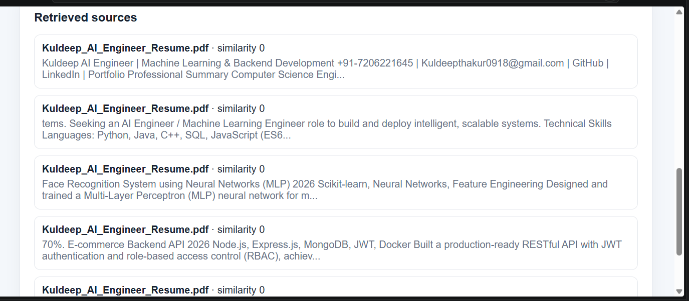

# 🤖 AI Document RAG Chatbot

An AI-powered document question-answering system built using **Retrieval-Augmented Generation (RAG)**. Users can upload PDF documents and ask questions about their content. The system retrieves relevant document chunks and uses them as context for grounded AI responses.

## 🚀 Features

* 📄 PDF document upload
* ✂️ Automatic text extraction and chunking
* 🧠 OpenAI embeddings for semantic representation
* 🔎 Similarity-based document retrieval
* 🤖 LLM-powered question answering
* 📚 Retrieved source display
* 💬 Interactive chat interface
* 🔐 Environment-variable based API configuration
* ⚡ React + Node.js full-stack architecture

## 🏗️ Architecture

```text
                  User
                   │
                   ▼
          ┌─────────────────┐
          │  React Frontend │
          └────────┬────────┘
                   │
                   ▼
          ┌─────────────────┐
          │ Node.js / API   │
          └────────┬────────┘
                   │
          ┌────────▼────────┐
          │  PDF Processing │
          │ Text Extraction │
          │   Chunking      │
          └────────┬────────┘
                   │
                   ▼
          ┌─────────────────┐
          │   Embeddings    │
          │     OpenAI      │
          └────────┬────────┘
                   │
                   ▼
          ┌─────────────────┐
          │  Vector Store   │
          │ Similarity      │
          │    Search       │
          └────────┬────────┘
                   │
                   ▼
          ┌─────────────────┐
          │ Relevant Context│
          └────────┬────────┘
                   │
                   ▼
          ┌─────────────────┐
          │       LLM       │
          │ Grounded Answer │
          └─────────────────┘
```

## 🔄 RAG Pipeline

```text
PDF
 ↓
Text Extraction
 ↓
Text Chunking
 ↓
Embedding Generation
 ↓
Vector Storage
 ↓
Similarity Search
 ↓
Relevant Context
 ↓
LLM
 ↓
Grounded Answer + Sources
```

## 🛠️ Tech Stack

### Frontend

* React
* Vite
* CSS

### Backend

* Node.js
* Express.js
* Multer
* PDF parsing

### AI / RAG

* OpenAI Embeddings
* OpenAI LLM
* Retrieval-Augmented Generation
* Cosine similarity search

### Development

* Git
* GitHub
* REST APIs
* Environment variables

## 📂 Project Structure

```text
AI-Document-RAG-Chatbot/
│
├── backend/
│   ├── services/
│   │   ├── ingest.js
│   │   ├── rag.js
│   │   └── vectorStore.js
│   ├── uploads/
│   └── server.js
│
├── frontend/
│   ├── src/
│   │   ├── main.jsx
│   │   └── style.css
│   └── index.html
│
├── .env.example
├── .gitignore
├── package.json
└── README.md
```

## ⚙️ Installation

### 1. Clone the repository

```bash
git clone https://github.com/erkuldeepthakur/AI-Document-RAG-Chatbot.git
cd AI-Document-RAG-Chatbot
```

### 2. Install dependencies

```bash
npm install
```

### 3. Configure environment variables

Create a `.env` file from `.env.example`:

```env
OPENAI_API_KEY=your_openai_api_key_here
OPENAI_CHAT_MODEL=gpt-5-mini
OPENAI_EMBEDDING_MODEL=text-embedding-3-small
PORT=5000
```

> Never commit `.env` or expose your API key publicly.

### 4. Start the application

```bash
npm run dev
```

Frontend:

```text
http://localhost:5173
```

Backend:

```text
http://localhost:5000
```

## 💬 How It Works

1. User uploads a PDF.
2. Backend extracts text from the document.
3. The text is divided into smaller chunks.
4. Each chunk is converted into an embedding.
5. Embeddings are stored in the vector store.
6. User submits a question.
7. The question is converted into an embedding.
8. Similar document chunks are retrieved.
9. Retrieved context is passed to the LLM.
10. The LLM generates a grounded response.
11. Relevant sources are displayed with the answer.

## 📸 Demo

The application provides an interactive interface for uploading PDF documents, indexing their content, asking questions, and retrieving relevant document sources.

### Main Interface



### Retrieved Sources




## 🎯 Why RAG?

Traditional LLM applications can hallucinate when they do not have access to domain-specific information.

RAG improves this workflow by retrieving relevant information from external documents and providing that information to the model as context before generating the response.

This makes the application more suitable for:

* Internal knowledge assistants
* Documentation assistants
* HR policy assistants
* Research document assistants
* Customer support knowledge bases

## 🔐 Security

* API keys are loaded through environment variables.
* `.env` is excluded through `.gitignore`.
* API secrets should never be committed to source control.
* GitHub Push Protection can help prevent accidental secret exposure.

## 🚧 Future Improvements

* Replace local vector storage with Pinecone, Qdrant or another production vector database.
* Add metadata filtering.
* Add document/page-level citations.
* Add authentication and user-specific document collections.
* Add conversation persistence.
* Add RAG evaluation metrics.
* Add streaming responses.
* Dockerize the application.
* Deploy frontend and backend separately.

## 📌 Resume Description

**AI Document RAG Chatbot** — Built a full-stack Retrieval-Augmented Generation application using React, Node.js, OpenAI embeddings and LLMs. Implemented PDF ingestion, text chunking, embedding generation, similarity-based retrieval and context-grounded question answering with source retrieval.

## 📄 License

This project is available for educational and portfolio purposes.
